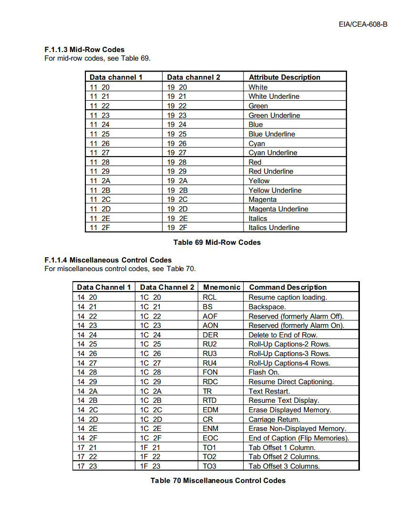
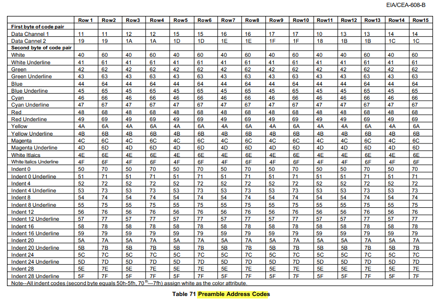
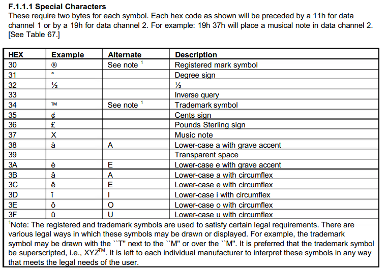
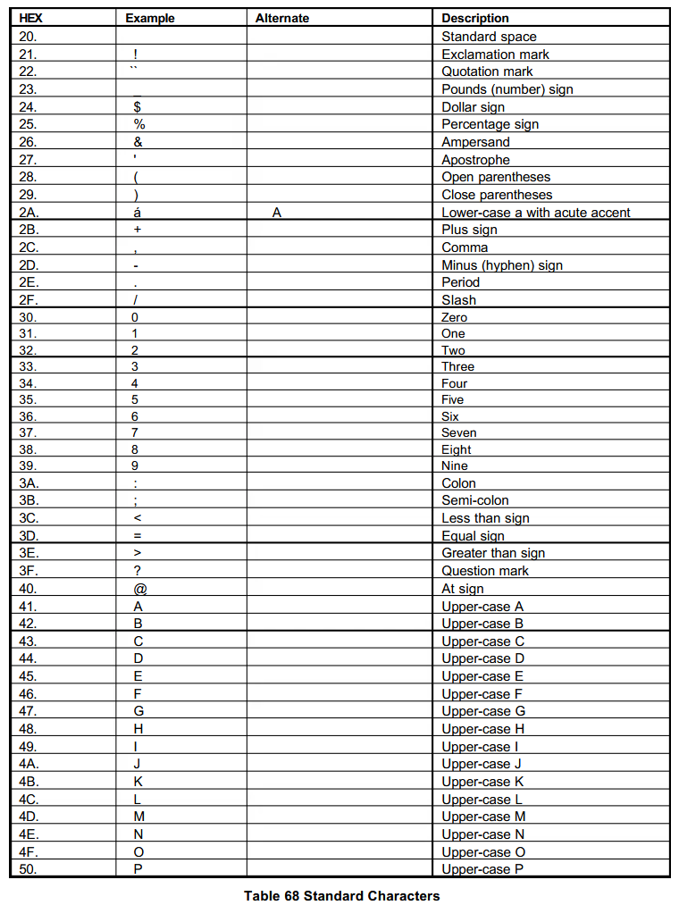
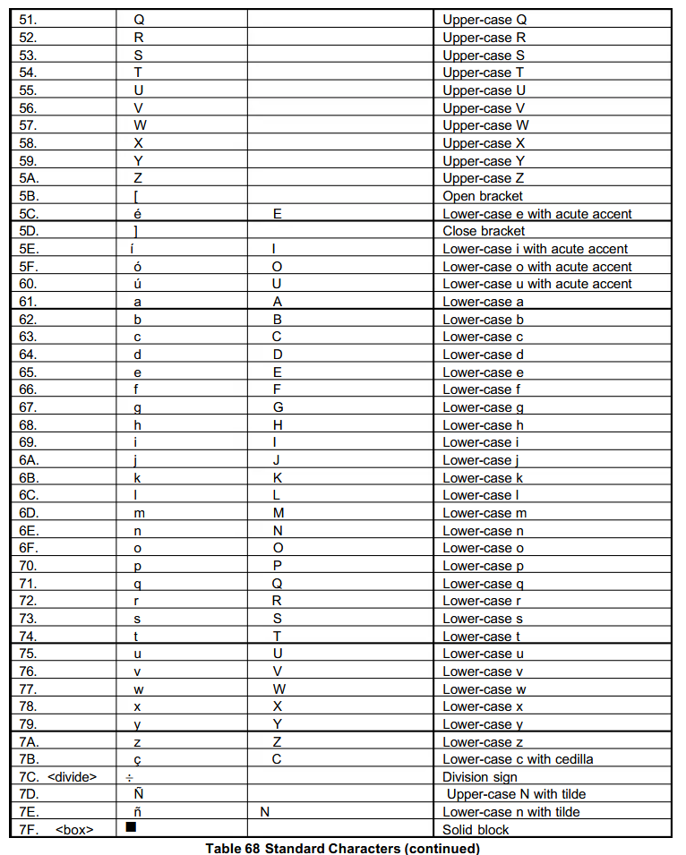
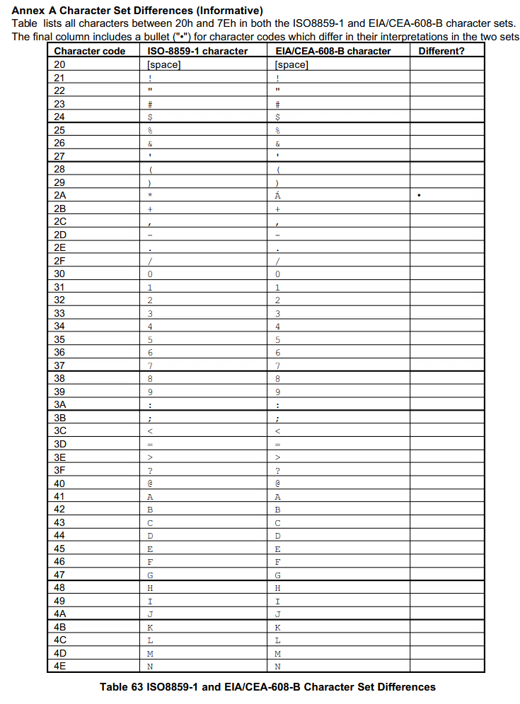
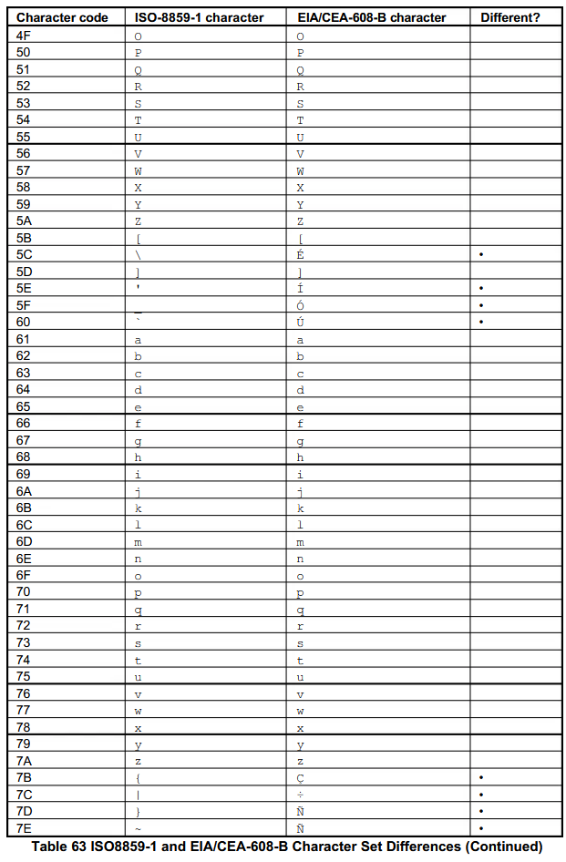
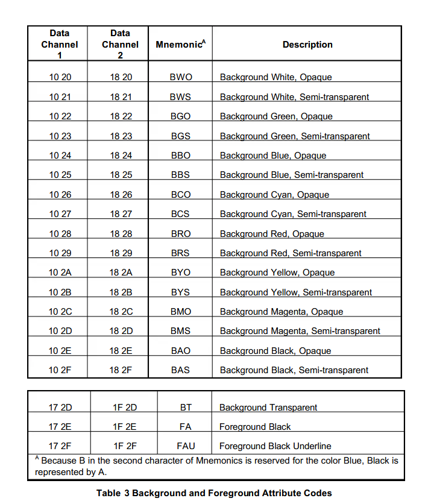

# EIA/CEA-608-B72

### B.8.1 Roll-Up Style

Precede each new row of text with these three codes:RU2 or RU3 or RU4 (to set roll-up style and depth)CR (to roll the display up one row)PAC (to set the indent and base row)To relocate the roll-up display immediately, send a PAC which implies the new base row. To continuepainting the current row, assuming the relocation occurred in the middle of a row, the PAC used shouldindent to the same column number where the cursor resided prior to the move or to the nearest indent to theleft of that column. The service provider should then either re-send enough characters to return the cursor toits original column, or use the appropriate Tab Offset command to move the cursor there.

### B.8.2 Paint-On Style

Each continuous transmission should be coded as follows:RDC (to select paint-on style)PAC (to set row, indent, attributes)text (characters to be painted onto this row)PAC (to relocate the cursor and/or set attributes)text or DERIf there is to be a pause in the data transmission, each new burst of data should be preceded by RDC.

### B.8.3 Pop-On Style

Each discrete caption should be coded as follows:RCL (to select pop-on style)ENM (optionally, to clear the memory for new data)PAC (to set row, indent, attributes)text (characters to be displayed on this row)PAC (to set position, attributes for next element)text, etc.EDM (optionally, to erase the currently displayed caption, if any)EOC (to display the caption just received)
An alternate, though less preferred, method is to "pre-send" pop-on captions by starting each burst of datawith EDM and EOC. This combination displays the previously sent caption, and then sends data for the nextcaption in advance of its desired appear time. If this method is chosen, care shall be taken to assure that acaption is not sent prematurely just before a long pause or a commercial break. A prematurely loadedcaption shall likely be lost during a commercial break, especially if one or more commercials are captioned.Viewers who tune in during the long pause or break shall not receive a prematurely loaded caption at all. Nocaption should be pre-sent more than 15 seconds before its appear time, since some decoders may,contrary to recommended practice (see Section C.9), automatically erase non-displayed memory if nocaption data are received for 16 seconds.In order to load a pop-on caption prior to its display, service providers nearly always (except for unusualspecial effects) want to start with non-displayed memory clear of any displayable characters or mid-rowcodes. It is important to remember that the EOC command "flips" displayed and non-displayed memory.This action forces the decoder into pop-on style, but does not erase data in either memory. Therefore, apreviously displayed caption created in any style shall move to non-displayed memory. To clear non-displayed memory for the next caption load, the service provider should send an EDM command before theEOC flip or send an ENM command after the EOC.Sending EDM before flipping memories creates a brief "blink" between captions, an effect which is oftendesirable. Sending ENM after flipping memories makes one caption appear instantly to replace another withno blink, an effect which may be desirable in some cases. (Note that since ENM is not supported by TC1,the only way in that decoder to clear non-displayed memory is to send EDM before the EOC command.)

---

### C.13 Right Margin Limitation (Regulatory/Normative)

According to the FCC rules, "once the cursor reaches the 32nd column position on any row, all subsequentcharacters received [prior to certain miscellaneous control codes] shall [replace] any previous character occupying that [cell]." In other words, the cursor can never move beyond the 32nd column. This limitationshould also hold true for Tab Offset commands. A Tab Offset can move the cursor to Column 32, but never beyond it. If the number of columns indicated by the Tab Offset plus the current column number is greater than 32, the cursor shall move only to Column 32.The FCC rules specify that "a Backspace received when the cursor is in Column 1 shall be ignored," but itdoes not specify how Backspace should be applied when it is received following a character displayed inColumn 32. Since the rules say, however, that "Backspace shall move the cursor one column to the left,erasing the character or Mid-Row Code occupying that location," and since there is no Column 33, manymanufacturers have concluded that a Backspace received either before or after displaying a character inColumn 32 shall move the cursor to Column 31 and erase the character there. This application is legal under the rules, and, although a different method might have been preferable, all decoders shall implementBackspace in this manner. When erasing Column 31, the decoder may also erase any displayablecharacter or other code in Column 32 (as is currently done in TC2).

